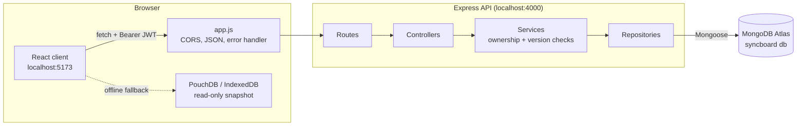
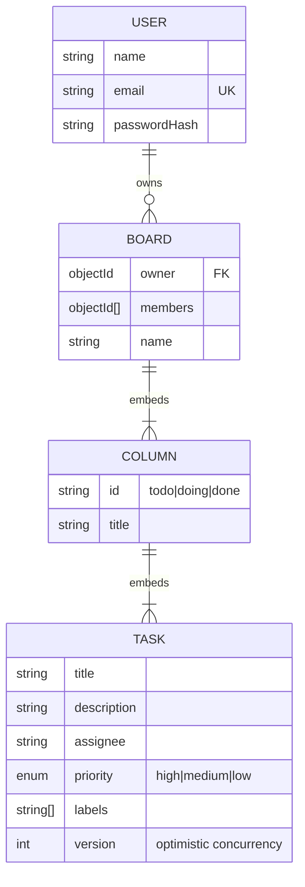

# SyncBoard

SyncBoard is a collaborative Kanban task board: teams create boards, tasks sit in
To Do / Doing / Done columns, and every read and write goes through a real REST
API backed by MongoDB Atlas. Registered users only ever see boards they own or
belong to, concurrent edits are detected instead of silently overwriting, and
the client keeps showing the last synced data when the network drops.

**Live deployment:** `<https://…>` *(filled in after Render deploy — see [Deployed (Render)](#deployed-render))*
**Demo account:** `demo@syncboard.app` / `password123`

## Tech stack

React 19 + Vite · Express 4 (ES modules) · MongoDB Atlas via Mongoose ·
JWT auth (bcrypt password hashing) · Zod validation · Socket.io realtime sync ·
PouchDB offline cache · Docker (Compose) · CORS · Jest+Supertest / Vitest+RTL · GitHub Actions CI

## How to run (local, ~5 minutes)

Prerequisites: Node.js 20+ and a MongoDB Atlas connection string (free M0 cluster).

```bash
# 1. API  →  http://localhost:4000
cd server
npm install
cp .env.example .env        # paste your Atlas URI as MONGODB_URI, set JWT_SECRET
npm run seed                # loads the demo user + 2 starter boards (idempotent)
npm run dev

# 2. Client  →  http://localhost:4000 is proxied via vite; open http://localhost:5173
cd ../client
npm install
npm run dev
```

Open <http://localhost:5173>, sign in as `demo@syncboard.app` / `password123`
(or register your own account — it starts with an empty board list).

> Windows PowerShell note: if `npm` is blocked by execution policy, use `npm.cmd`.

## Project layout

```
client/            React + Vite front end
  src/api/         fetch wrapper (client.js), endpoint functions (boards.js), PouchDB cache (cache.js)
  src/context/     AuthContext (user + token), BoardsContext (boards, API-backed mutations, offline fallback)
  src/components/  presentational pieces (Board, Column, TaskCard, TaskModal, OfflineBanner, …)
  src/pages/       one component per route
  src/utils/       pure helpers (filtering, counters)
server/            Express API
  src/routes/      router definitions only
  src/controllers/ read req, call service, send res
  src/services/    business rules (ownership checks, version conflicts) — no req/res here
  src/repositories/ Mongoose data access
  src/models/      Mongoose schemas (User, Board with embedded columns → tasks)
  src/middleware/  authenticate JWT, validate (Zod), rate limiting, central error handler
  src/db/          Mongo connection
  scripts/seed.js  seeds the demo user + starter boards
```

## Deployed (Render)

One `render.yaml` blueprint in the repo root provisions both tiers:

1. Atlas: M0 cluster, **Network Access → allow `0.0.0.0/0`** (Render's outbound IPs
   are dynamic on the free tier). Run `npm run seed` once against it.
2. Render dashboard → **New → Blueprint** → select this repo → paste
   `MONGODB_URI` when asked → `syncboard-api` (web) and `syncboard-client`
   (static) are created.
3. Replace the two `CHANGE-ME-…` values in `render.yaml` with the real hostnames
   (`CLIENT_ORIGIN` = client URL for CORS, `VITE_API_URL` = API URL), commit —
   Render auto-redeploys. `JWT_SECRET` is generated in the dashboard.
4. Verify `https://<api-url>/api/health` → `{"status":"ok"}`.

Caveats: free web services sleep after ~15 min idle (first request takes up to a
minute); the app sets `trust proxy 1` so rate limiting sees real IPs; SPA routes
are rewritten to `index.html` by the blueprint; secrets live only in local
`.env` (gitignored) and the Render dashboard — never in git.


## Architecture



### Database schema



**Embedding vs referencing:** columns and tasks are embedded inside their board
document because they are never read or written without the board, the arrays are
bounded in size, and one document save gives us atomic task edits/moves for free.
Users are a separate top-level collection because they are looked up by email at
login and referenced from many boards (`owner`/`members`).

### Concurrency (conflict detection)

Every task carries a `version` that increments on each write. The edit form
echoes back the version it loaded; if the server's version differs, the PATCH is
rejected with **409 CONFLICT** (`{ currentVersion, yourVersion }`) and the UI
offers "reload latest" — a concurrent edit is surfaced, never silently lost.
Offline **writes** queue/reconcile on the Session 5 milestone; for now an offline
edit fails visibly instead of pretending to save.

### Realtime

The API wraps Express in a Socket.io server. Any successful board/task write
emits `boards:changed`; every connected client answers that with a single
refetch — so two browsers on one board converge within a second, without a page
refresh. The payload is only a `{ boardId }` hint (no data leaks: a non-member's
refetch still 403s). When the socket is down (server asleep/offline), the app
falls back to plain request/response behaviour with zero degraded functionality.

### Run everything with Docker

Whole stack, one command (Docker Desktop required):

```bash
docker compose up --build        # mongo + server + client
docker compose run --rm seed     # one-shot: demo user + starter boards
# open http://localhost:8080 (API at http://localhost:4000)
```

`server/Dockerfile` and `client/Dockerfile` are self-contained (node:20-alpine →
nginx two-stage for the client). Compose uses a local `mongo` container; point
`MONGODB_URI` at Atlas instead to run the containers against the cloud DB.


## REST API

Auth: `Authorization: Bearer <token>` from register/login. Tokens expire after 1h.
All responses share one shape: success `{ "data": … }`, failure `{ "error": { message, code, details } }`.

| Method | Path | Auth | Success | Possible errors |
|---|---|---|---|---|
| GET | `/api/health` | no | 200 | — |
| POST | `/api/auth/register` | no | 201 + token | 400, 409 EMAIL_TAKEN |
| POST | `/api/auth/login` | no | 200 + token | 400, 401 BAD_CREDENTIALS, 429 RATE_LIMITED (5/min) |
| GET | `/api/auth/me` | yes | 200 | 401 |
| GET | `/api/boards` | yes | 200 + `[…]` (mine only) | 401 |
| POST | `/api/boards` | yes | 201 | 400, 401 |
| GET | `/api/boards/:boardId` | yes | 200 | 401, 403, 404 |
| PATCH | `/api/boards/:boardId` | yes | 200 | 400, 401, 403, 404 |
| GET | `/api/boards/:boardId/tasks` | yes | 200 + `[…]`, `?q=` `?status=` filters | 401, 403, 404 |
| POST | `/api/boards/:boardId/tasks` | yes | 201 | 400, 401, 403, 404 |
| PATCH | `/api/boards/:boardId/tasks/:taskId` | yes | 200 | 400, 401, 403, 404, 409 CONFLICT (stale version) |
| DELETE | `/api/boards/:boardId/tasks/:taskId` | yes | 204 | 401, 403, 404 |

401 codes: `NO_TOKEN`, `BAD_TOKEN`, `TOKEN_EXPIRED`, `BAD_CREDENTIALS`.
401 = "who are you?"; 403 = "I know you, and this board is not yours."

**Postman:** import `server/postman/syncboard.postman_collection.json`, set
`baseUrl` (local or the deployed API URL). Run request 1 or 2 first — it saves the
token automatically — then request 4 (`boardId`/`taskId` auto-fill). Requests
F1–F8 are the failure-case suite (401/403/409/429/404/400).

## Tests

```bash
cd server && npm test   # Jest + Supertest against a real in-memory MongoDB (no Atlas needed)
cd client && npm test   # Vitest + React Testing Library (jsdom)
```

- **Server** (`server/tests/`): auth flow (register/duplicate/wrong-password/me), board ownership
  (401/403/404 + create/rename), task CRUD + filters + 409 version conflicts — 17 tests over 3 suites.
  A mongodb-memory-server instance is booted per suite; no external DB required, CI-safe.
- **Client** (`client/src/__tests__/`): pure board helpers, Board rendering + search filtering,
  and the create-task form (validation blocks bad input, server errors render inline) — 8 tests over 4 files.
- **Regression guard:** `tasks.test.js › PATCH with status moves the task between columns` covers the
  bug where the Zod update schema silently stripped `status` out of PATCH bodies.
- **CI:** `.github/workflows/ci.yml` runs lint + both suites on every push/PR to `main` (Node 20 & 22).

## Security notes

- Passwords are bcrypt-hashed (cost 10); hashes are never returned by any endpoint.
- `JWT_SECRET` and `MONGODB_URI` live only in `.env` (gitignored) / Render dashboard.
- Login is rate-limited (5 attempts/IP/minute).
- Board endpoints require a valid token *and* board membership (owner/members).

## Known limitations (honest list)

- No member-invite flow yet — boards are single-owner today (`members` exists in the schema for the next milestone).
- Realtime is fan-out refetch, not differential sync; on Render's free tier the websocket idles away when the service sleeps (wake the page once, then demo).
- Offline writes are refused visibly rather than queued for sync-after-reconnect.
- Token lives in `localStorage` (documented trade-off vs httpOnly cookies, see Session 2 notes).
